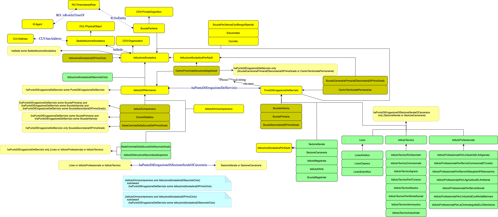

# School-AP_IT — Ontologia del Sistema Scolastico Italiano

**URI ufficiale:** `https://w3id.org/italia/onto/School`  
**Versione:** 0.1 (16 giugno 2026)  
**Licenza:** [CC BY 4.0](https://creativecommons.org/licenses/by/4.0/)  
**Stato:** Published  
**Rete di appartenenza:** [OntoPiA](https://github.com/italia/daf-ontologie-vocabolari-controllati)

---

## Descrizione

School-AP_IT è un'ontologia OWL che modella il **sistema scolastico italiano**, fornendo un vocabolario formale per descrivere le istituzioni scolastiche, i punti di erogazione del servizio didattico e le relazioni che le legano.

Le entità principali dell'ontologia sono:

- **Istituzione Scolastica** (`school:IstituzioneScolastica`) — l'ente giuridico e amministrativo autonomo ai sensi del D.P.R. 275/1999, titolare dell'offerta formativa e dotato di proprio codice fiscale e dirigenza.
- **Punto di Erogazione del Servizio** (`school:PuntoDiErogazioneDelServizio`) — il luogo fisico (plesso, sede distaccata, sezione) in cui si svolge concretamente l'attività didattica, identificato da un proprio codice meccanografico ministeriale.

Questa distinzione riflette l'organizzazione reale del sistema scolastico italiano, in cui un'unica istituzione dotata di autonomia (es. un Istituto Comprensivo) può gestire più punti di erogazione del servizio collegati ad uno o più edifici distribuiti sul territorio.

---

## Diagramma



Il diagramma mostra la gerarchia delle classi e le relazioni principali dell'ontologia. Le classi sono organizzate attorno ai due concetti centrali: `IstituzioneScolastica` (in giallo) e `PuntoDiErogazioneDelServizio` (in verde), con le rispettive sottoclassi e i collegamenti alle ontologie esterne COV, CLV, RO e DUL.

---

## Copertura tematica

L'ontologia modella i principali cicli e tipologie di istruzione previsti dall'ordinamento italiano. 
Le denominazioni dei punti dell'ontologia derivano in gran parte dalle modalità delle variabili DescrizioneTipologiaGradoIstruzioneScuola e DescrizioneCaratteristicaScuola presenti nelle informazioni anagrafiche [scuole degli open data](https://dati.istruzione.it/opendata/opendata/catalogo/elements1/leaf/?area=Scuole&datasetId=DS0400SCUANAGRAFESTAT)


**Primo ciclo**
- Scuola dell'Infanzia
- Scuola Primaria
- Scuola Secondaria di Primo Grado
- Istituto Comprensivo, Circolo Didattico, Istituto Omnicomprensivo

**Secondo ciclo**
- Licei (Classico, Scientifico, Artistico, e altri)
- Istituti Tecnici (Commerciale, Industriale, Agrario, Nautico, Aeronautico, Per Geometri, Per il Turismo, Per Attività Sociali)
- Istituti Professionali (Industria e Artigianato, Agricoltura e Ambiente, Servizi Alberghieri e Ristorazione, Servizi Commerciali e Turistici, Servizi Sociali, Industria e Attività Marinare, Cinematografia e Televisione)
- Istituto di Istruzione Secondaria Superiore (IISS)

**Istruzione degli adulti e contesti speciali**
- Centri Provinciali per l'Istruzione degli Adulti (CPIA)
- Sezioni Serali del secondo ciclo di istruzione
- Sezioni Carcerarie del secondo ciclo di istruzione
- Scuola Carceraria Primaria e Secondaria di Primo Grado

**Tipologie storiche** (mantenute per compatibilità con dati storici)
- Istituto Magistrale, Scuola Magistrale, Istituto d'Arte, Centro Territoriale Permanente, Circolo Didattico

**Altre tipologie**
- Convitto, Educandato
- Scuola Paritaria
- Scuola per Utenza con Bisogni Speciali

---

## Struttura dell'ontologia

### Proprietà oggetto principali

| Proprietà | Dominio | Range | Descrizione |
|-----------|---------|-------|-------------|
| `school:haSede` | `IstituzioneScolastica` | `SedeIstituzioneScolastica` | Collega l'istituzione alla sua sede legale e amministrativa |
| `school:haPuntoDiErogazioneDelServizio` | `IstitutoDiRiferimento` | `PuntoDiErogazioneDelServizio` | Collega l'istituto di riferimento ai propri plessi |
| `school:haPuntoDiErogazioneDiSezioneSeraleOCarceraria` | `Liceo` ∪ `IstitutoTecnico` ∪ `IstitutoProfessionale` | `SezioneSerale` ∪ `SezioneCarceraria` | Specializzazione per sezioni serali e carcerarie |

### Gerarchia delle classi principali

```
IstituzioneScolastica
├── IstitutoDiRiferimento
│   ├── IstitutoComprensivo
│   ├── CircoloDidattico
│   ├── SedeCentraleDellaScuolaDelPrimoGrado
│   ├── SedeCentraleDellaScuolaDelSecondoGrado
│   ├── IstitutoDiIstruzioneSecondariaSuperiore
│   ├── IstitutoOmnicomprensivo
│   └── CentroProvincialiIstruzioneDegliAdulti
├── IstituzioneScolasticaDiPrimoCiclo
├── IstituzioneScolasticaDiSecondoCiclo
├── IstituzioneScolasticaPerAdulti
├── Convitto
├── Educandato
├── ScuolaParitaria
└── ScuolaPerUtenzaConBisogniSpeciali

PuntoDiErogazioneDelServizio
├── ScuolaInfanzia
├── ScuolaPrimaria
├── ScuolaSecondariaDiPrimoGrado
├── Liceo
│   ├── LiceoClassico
│   ├── LiceoScientifico
│   └── LiceoArtistico
├── IstitutoTecnico
│   ├── IstitutoTecnicoCommerciale
│   ├── IstitutoTecnicoIndustriale
│   ├── IstitutoTecnicoAgrario
│   ├── IstitutoTecnicoNautico
│   ├── IstitutoTecnicoAeronautico
│   ├── IstitutoTecnicoPerGeometri
│   ├── IstitutoTecnicoPerIlTurismo
│   └── IstitutoTecnicoPerAttivitaSociali
├── IstitutoProfessionale
│   ├── IstitutoProfessionalePerLIndustriaELArtigianato
│   ├── IstitutoProfessionalePerLAgricolturaELAmbiente
│   ├── IstitutoProfessionalePerIServiziAlberghieriERistorazione
│   ├── IstitutoProfessionalePerIServiziCommercialiETuristici
│   ├── IstitutoProfessionalePerIServiziSociali
│   ├── IstitutoProfessionalePerLIndustriaELeAttivitaMarinare
│   └── IstitutoProfessionalePerLaCinematografiaELaTelevisione
├── SezioneSerale
├── SezioneCarceraria
├── CentroTerritorialePermanente
├── ScuolaCarcerariaPrimariaESecondariaDiPrimoGrado
├── IstitutoMagistrale
├── ScuolaMagistrale
└── IstitutoDArte
```

---

## Allineamenti con altre ontologie

School-AP_IT è parte della rete **OntoPiA** ed è allineata con:

| Ontologia | URI | Uso |
|-----------|-----|-----|
| COV — Organizzazioni | `https://w3id.org/italia/onto/COV` | `IstituzioneScolastica` è sottoclasse di `COV/Organization`; `ScuolaParitaria` di `COV/PrivateOrganization` |
| CLV — Luoghi e Indirizzi | `https://w3id.org/italia/onto/CLV` | `SedeIstituzioneScolastica` ha indirizzo tramite `CLV/hasAddress` |
| RO — Ruoli | `https://w3id.org/italia/onto/RO` | Modellazione dei ruoli istituzionali |
| DUL — DOLCE+DnS Ultralite | `http://www.ontologydesignpatterns.org/ont/dul/DUL.owl` | `SedeIstituzioneScolastica` è sottoclasse di `DUL/PhysicalObject` |

---

## Riferimenti normativi

L'ontologia riflette l'ordinamento scolastico italiano così come definito da:

- **D.Lgs. 16 aprile 1994, n. 297** -- Testo Unico delle disposizioni legislative vigenti in materia di istruzione
- **D.P.R. 26 maggio 1998, n. 157** -- Regolamento concernente l'aggregazione di istituti scolastici di istruzione secondaria superiore
- **D.P.R. 18 giugno 1998, n. 233** -- Regolamento per il dimensionamento ottimale delle istituzioni scolastiche
- **D.P.R. 8 marzo 1999, n. 275** -- Regolamento recante norme in materia di autonomia delle istituzioni scolastiche
- **Legge 10 marzo 2000, n. 62** -- Norme per la parità scolastica e disposizioni sul diritto allo studio e all'istruzione
- **D.P.R. 30 giugno 2000, n. 230** -- Regolamento recante norme sull'ordinamento penitenziario
- **Legge 28 marzo 2003, n. 53** -- Delega al Governo per la definizione delle norme generali sull'istruzione
- **D.Lgs. 19 febbraio 2004, n. 59** -- Definizione delle norme generali relative alla scuola dell'infanzia e al primo ciclo dell'istruzione
- **D.P.R. 15 marzo 2010, nn. 87, 88, 89** -- Regolamenti di riordino degli istituti professionali (87), tecnici (88) e licei (89)
- **Legge 15 luglio 2011, n. 111 (Art. 19)** -- Conversione del D.L. 98/2011 (Razionalizzazione della spesa relativa all'organizzazione scolastica)
- **D.P.R. 29 ottobre 2012, n. 263** -- Regolamento per la ridefinizione dell'assetto organizzativo didattico dei Centri d'istruzione per gli adulti
- **D.Lgs. 13 aprile 2017, n. 61** -- Revisione dei percorsi dell'istruzione professionale

---

## Creatori e responsabilità

| Ruolo | Ente |
|-------|------|
| Creatore | [STLab — ISTC-CNR](https://stlab.istc.cnr.it) |
| Creatore | [INDIRE](https://www.indire.it) |
| Rights Holder | [Ministero dell'Istruzione e del Merito](https://www.mim.gov.it/) |

---

## Contenuto del repository

```
School/
├── README.md          # Questo file
├── latest/
│   ├── School-AP_IT.ttl      # Serializzazione RDF/Turtle
│   ├── School-AP_IT.rdf      # Serializzazione RDF/XML
│   └── School-AP_IT.jsonld   # Serializzazione JSON-LD
└── v0.1/
    ├── School-AP_IT.ttl
    ├── School-AP_IT.rdf
    ├── School-AP_IT.jsonld
    └── School.png            # Diagramma dell'ontologia
```

---

## Come citare

```
School-AP_IT — Ontologia del Sistema Scolastico Italiano, v0.1.
STLab-ISTC-CNR & INDIRE, 2026.
https://w3id.org/italia/onto/School
```
